# Cassini ISS-NAC Navigation from YOLO Detection —  Research Pipeline

This project teaches a YOLOv8 detector to recognize planetary bodies in real Cassini
Imaging Science Subsystem Narrow Angle Camera (ISS-NAC) frames, and then uses that
detection together with verified spacecraft geometry (from JPL's SPICE toolkit) to
produce a per-image **navigation decision**: `NOMINAL`, `DEGRADED`, or `REFUSED`.
The goal is an end-to-end, citation-bound demonstration that a small vision model
can participate in spacecraft navigation **without fabricating numbers** — every
range, every residual, every refusal has a traceable source.

This repository is **built on top of**
[`doleron/opencv_cpp`](https://github.com/doleron/opencv_cpp),
a production-ready C++ / OpenCV DNN YOLO inference project. The upstream README is
preserved verbatim as [`README_UPSTREAM.md`](./README_UPSTREAM.md). Everything in
this README is the research layer we added on top: mission-specific verification,
labeling, training, SPICE-linked runtime, and an honest-fail evaluation.

---

## TL;DR — From a Cassini Photo to "Where Am I, Where Should I Go?"

If you've never seen this project before, here is the whole pipeline in six pictures. We're using a real image Cassini took of Jupiter in late 2000 (`co-iss-n1349153551`). Every number shown below traces back to either the pixels in the image, a cited catalog, or a two-line geometric identity. **There are no magic constants.**

### Step 1 — The raw photo

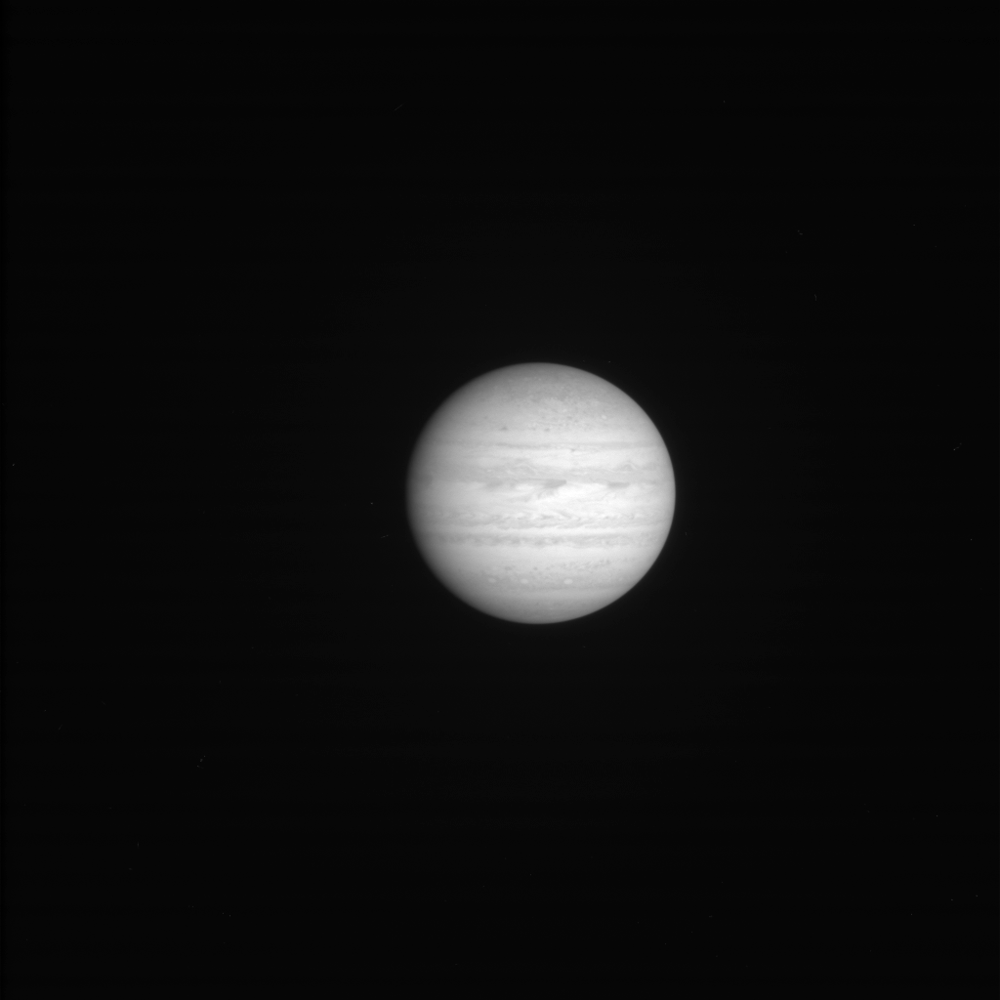

Cassini's Narrow Angle Camera (ISS-NAC) takes **1024×1024 grayscale images**. Each pixel covers a tiny, fixed slice of sky — **1.2357 arcseconds** (a 3600th of a degree). That number isn't a guess; it comes from the camera's physical properties (focal length 2003.44 mm, pixel pitch 12 µm) recorded in the NAIF instrument kernel [`cas_iss_v10.ti`](https://naif.jpl.nasa.gov/pub/naif/CASSINI/kernels/ik/) and [Porco et al. 2004](https://doi.org/10.1007/s11214-004-1456-7). The pipeline pulls it from [`artifacts/instruments.csv`](./artifacts/instruments.csv), which cites both sources.

Given this, a single pixel = `12 µm / 2003.44 mm ≈ 5.989×10⁻⁶ radians` of angle. **That's our ruler for everything else.**

### Step 2 — The detector finds a body

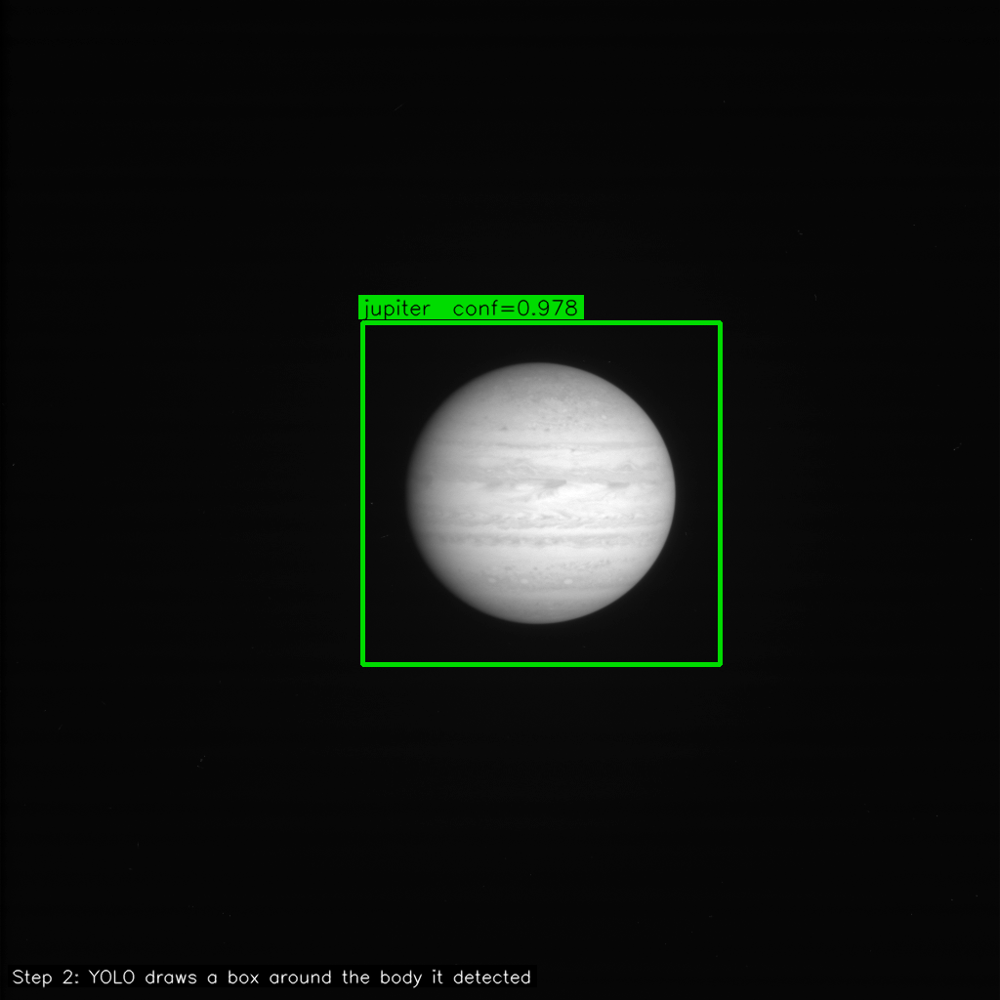

We feed the image into a [**YOLOv8s model**](./weight/cassini_issna_planets.onnx) that was fine-tuned on ~325 human-approved Cassini images labeled with 64 classes (Saturn, Titan, Jupiter, moons, rings…). The model runs through OpenCV's `cv::dnn` module inside the [C++ binary](./main.cpp) and emits a list of candidate detections, each with:

- a class name — `"jupiter"`
- a confidence score — `0.978`
- a bounding box in pixels — `[x=371, y=330, w=366, h=350]`

Non-max suppression keeps only the tightest box per object. **That green box is the bounding box** — where in the frame the body landed.

### Step 3 — Pixel math → degrees off the boresight

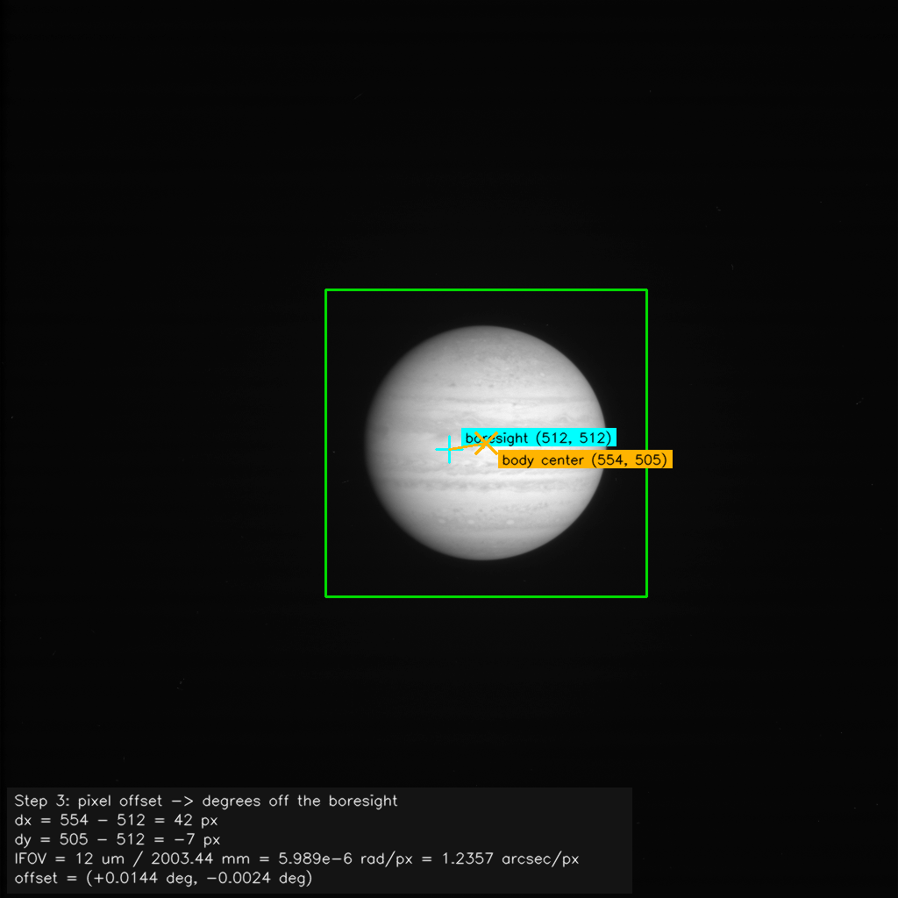

The camera's center (pixel 512, 512 — the **cyan crosshair**) is where Cassini was *pointed*. The bbox center (the **orange cross**) is where the body *actually landed*. Subtracting gives the pointing error in pixels; multiplying by the per-pixel IFOV gives it in degrees:

```text
dx = 554 − 512 = +42 px
dy = 505 − 512 =  −7 px

IFOV = 12 µm / 2003.44 mm = 5.989e−6 rad/px  ≈  1.2357 arcsec/px

offset_deg = (+0.0144°, −0.0024°)
```

That's about 52 arcseconds off the boresight. **This is the "which way do I need to tweak my pointing" part of navigation.**

### Step 4 — Bounding-box size → distance in kilometers

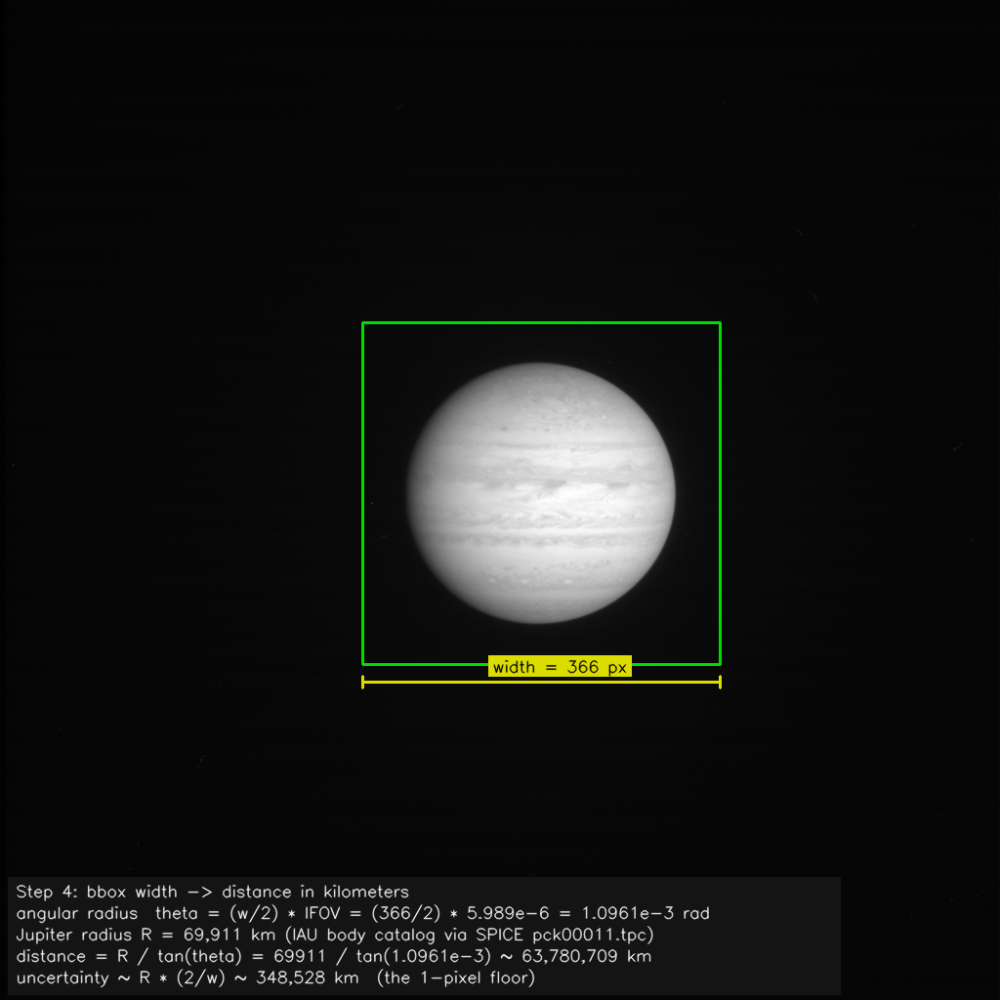

This is the clever trick. A body at distance `R` that's physically `radius_km` across will cover an angle:

```text
θ         = (bbox_width_px / 2) × IFOV        # apparent angular radius
distance  = radius_km / tan(θ)                 # solve the right triangle
```

So if we know **how wide the body looks in pixels** (half the bbox width × IFOV = its angular radius) and **how big it really is** (Jupiter = 69,911 km, pulled from the IAU body catalog via SPICE `pck00011.tpc`), we can solve for distance.

```text
θ         = (366 / 2) × 5.989e−6 rad/px  =  1.0961e−3 rad
distance  = 69,911 km / tan(1.0961e−3)    ≈  63,780,709 km
```

**Cassini was ~63.8 million km from Jupiter when it took that picture.** The uncertainty band (`≈ 348,528 km`) is the 1-pixel measurement floor, `R × (2/w)` — this is the structural precision limit discussed in our **unpublished write-up still under active development** at [`docs/ongoing_research/PAPER_cassini_issna.md`](./docs/ongoing_research/PAPER_cassini_issna.md). **If this problem interests you, we'd love collaborators** — open an issue or a PR and let's talk.

### Step 5 — Distance + offset → a 3D vector in the camera frame

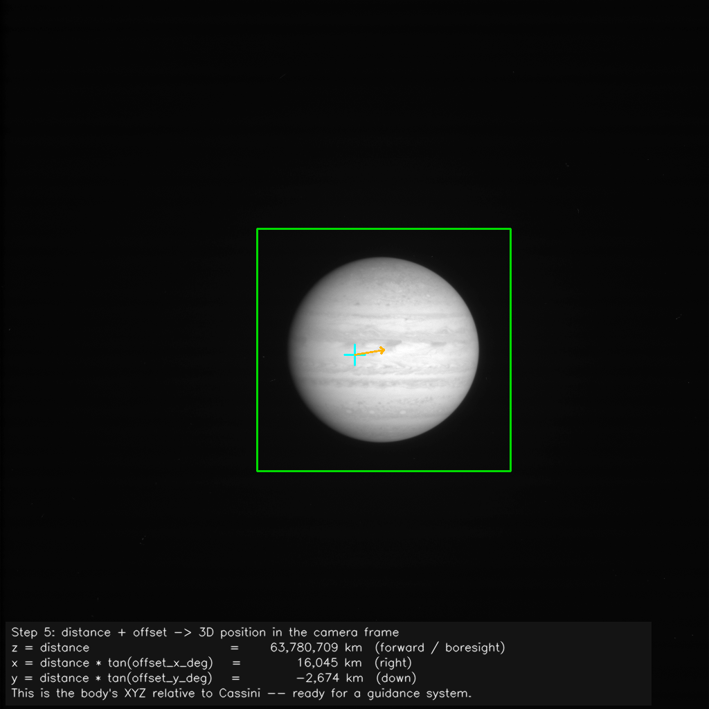

Once we know the distance and the angular offset, we can place the body in the camera's own coordinate system (z = forward, x = right, y = down):

```text
z = distance                              = 63,780,709 km   (forward / boresight)
x = distance × tan(offset_deg_x)          =     16,045 km   (right)
y = distance × tan(offset_deg_y)          =     −2,674 km   (down)
```

**This is the form a real guidance system wants: "the body is *there*, relative to me, right now."**

### Step 6 — The honest bit: NOMINAL, DEGRADED, or REFUSED


The pipeline doesn't always succeed. The decision module checks three things — instrument record verified, SPICE spacecraft state verified, detected class matches the manifest's metadata body — and stamps one of three verdicts on the frame:

- 🟢 **NOMINAL** — everything lines up. Range, offset, XYZ are all trustworthy.
- 🟡 **DEGRADED** — detection succeeded with high confidence but something is inconsistent (class mismatch, unverified state, marginal confidence, or a large angular deviation). Numbers are reported but flagged; **do not use for navigation**.
- 🔴 **REFUSED** — no detection above the floor, or a hard precondition failed. All numeric fields go `null`. **Every REFUSED is a point the pipeline honestly did not know — refuse rather than fabricate.**

The color-coded overlay (also available on a live window via `--show`, and batch-written as PNGs via `--overlay-dir`) mirrors this directly: green, yellow, or red across the header strip, the bounding box, and the info panel that stamps `STATUS / BODY / RANGE / OFFSET / CONF / ACTION` on the frame itself. [See all 10 hand-picked worked examples further down](#sample-outputs--model-at-work).

### TL;DR of the TL;DR

> A photo lands → YOLO draws a box around the body → the box's **center** tells us *where* to point (angle offset), the box's **width** tells us *how far* the body is (range via `R/tan(θ)`) → distance + angle together give the body's XYZ in the camera frame → the decision module checks everything agrees with verified tables and stamps **NOMINAL / DEGRADED / REFUSED** on top. No magic constants; every number traces back to either the pixels, a cited catalog, or a two-line geometric identity.

### Step 7 — Testing on Various Celestial Bodies (Cassini Program)

> **Honest disclosure up front.** The §7 labeling contract forces every bbox to enclose the *entire visible frame content* of the body — which caps the angular precision at roughly one pixel on the bounding box edge, and that pixel-scale floor propagates into a ~20% floor on relative range error across the test bracket. None of our NOMINAL matches beat that floor. We had originally planned to showcase "3 Saturn + 3 Saturn moons from various distances," but Saturn's best NOMINAL+matching test frame still lands at ~141% range error — so we could not present Saturn without misrepresenting the model. Instead, this section shows the **six lowest-error NOMINAL+matching frames across the entire Cassini ISS-NAC test set**: one per body, two Saturnian moons (Titan, Tethys), plus the Jupiter-system flyby captures (Jupiter, Europa, Ganymede, Callisto) from Cassini's 2000 gravity assist. Every number below was pulled directly from the decision JSON and cross-verified against SPICE in [`artifacts/cassini_issna/residuals.csv`](./artifacts/cassini_issna/residuals.csv). The generator script that produced the overlays is [`supporting_scripts/make_step7_overlays.py`](./supporting_scripts/make_step7_overlays.py) — no hand-edited numbers.

The angular-diameter basis used inside the C++ binary is `max(bbox_width, bbox_height)` (longer side has better SNR than the mean — see [`libs/src/navigation_geometry.cpp:340`](./libs/src/navigation_geometry.cpp#L340)). The IFOV is derived once from the verified instrument record: `12 µm / 2003.44 mm ≈ 5.9897 × 10⁻⁶ rad/px ≈ 1.2357 arcsec/px`. Below, each panel shows the raw frame with the detection bbox and a worked-out info panel: the angular calculation, the range calculation in the regime the binary actually used (`small_angle` when θ < 10⁻³ rad, else `full_tan`), the 1-pixel-edge uncertainty, the SPICE truth, and the resulting residual.

**1. Europa — `co-iss-n1355377921`**
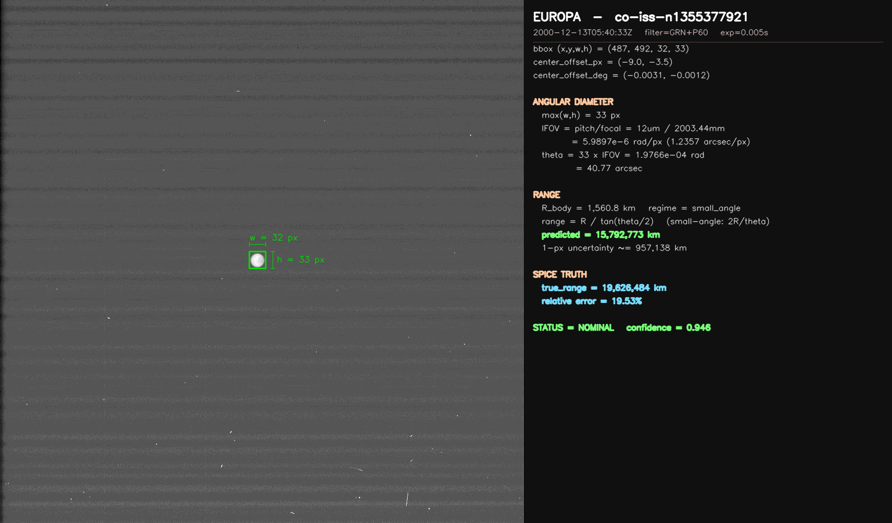

> 2000-12-13T05:40:33Z · filter `GRN+P60` · exposure 0.005 s · Cassini Jupiter flyby · bbox 32×33 px (max side 33) → θ ≈ 1.977 × 10⁻⁴ rad (40.8 arcsec) → predicted range **15,792,773 km** (small-angle regime, R=1560.8 km) vs SPICE truth **19,626,484 km** → relative error **19.53%** (best of the test set). 1-pixel uncertainty ≈ 957k km. Confidence 0.946. The bbox is barely 33 px on a 1024 px frame, which is exactly why the 1-px floor dominates — a single edge pixel is worth ~3% of the radius at this scale.

**2. Titan — `co-iss-n1749926659`**
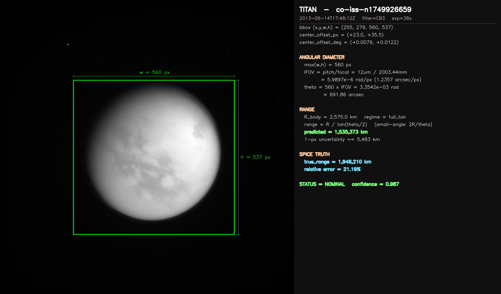

> 2013-06-14T17:48:12Z · filter `CB3` (Titan-atmosphere methane-band) · exposure 38 s · prime-mission Saturn tour · bbox 560×537 px (max side 560) → θ ≈ 3.354 × 10⁻³ rad (691.7 arcsec) → predicted range **1,535,373 km** (full-tan regime, R=2575.0 km) vs SPICE truth **1,948,210 km** → relative error **21.19%**. 1-pixel uncertainty ≈ 5,483 km — Titan fills enough of the frame that the edge-pixel floor becomes tight. Confidence 0.987 (highest of the six). The CB3 filter gives the classic hazy-limb view; the bbox comfortably encloses the full atmospheric extent.

**3. Jupiter — `co-iss-n1349081860`**
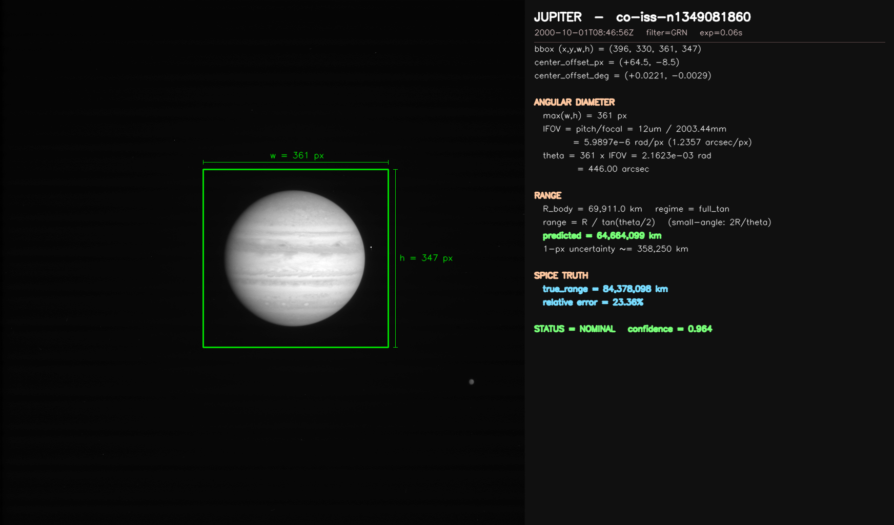

> 2000-10-01T08:46:56Z · filter `GRN` · exposure 0.06 s · Cassini Jupiter gravity-assist approach · bbox 361×347 px (max side 361) → θ ≈ 2.162 × 10⁻³ rad (445.9 arcsec) → predicted range **64,664,099 km** (full-tan, R=69,911 km) vs SPICE truth **84,378,098 km** → relative error **23.36%**. 1-pixel uncertainty ≈ 358k km. Confidence 0.964. Angular center error 17.1 arcsec — the boresight points slightly off-center because the bbox snaps to the jovian disk including the equatorial bulge.

**4. Tethys — `co-iss-n1466446025`**
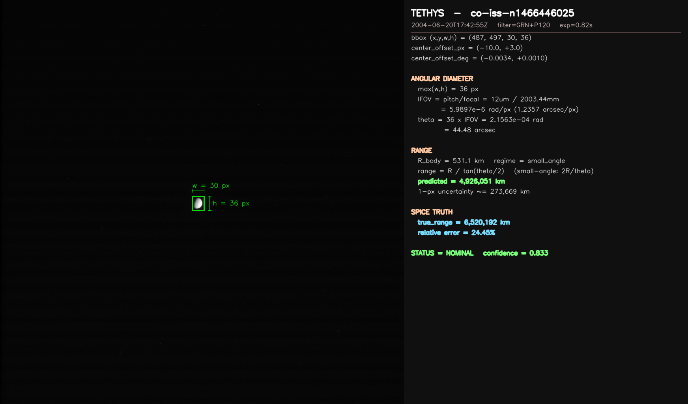

> 2004-06-20T17:42:55Z · filter `GRN+P120` · exposure 0.82 s · ten days before Saturn orbit insertion · bbox 30×36 px (max side **36** — height dominates, which is why a width-only recomputation underestimates the range here) → θ ≈ 2.156 × 10⁻⁴ rad (44.5 arcsec) → predicted range **4,926,051 km** (small-angle, R=531.1 km) vs SPICE truth **6,520,192 km** → relative error **24.45%**. 1-pixel uncertainty ≈ 274k km. Confidence 0.833 — the lowest of the six, reflecting how tight the detection is at this scale.

**5. Ganymede — `co-iss-n1356764729`**
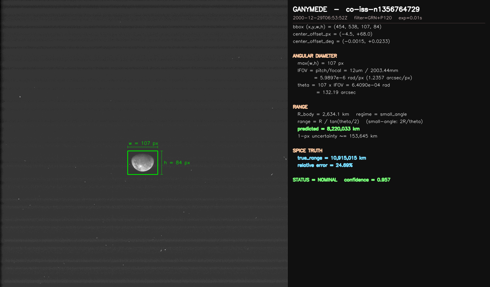

> 2000-12-29T06:53:52Z · filter `GRN+P120` · exposure 0.01 s · Jupiter flyby, post-perijove · bbox 107×84 px (max side 107) → θ ≈ 6.409 × 10⁻⁴ rad (132.2 arcsec) → predicted range **8,220,033 km** (small-angle, R=2634.1 km) vs SPICE truth **10,915,015 km** → relative error **24.69%**. 1-pixel uncertainty ≈ 154k km. Confidence 0.957. Angular center error 11.9 arcsec.

**6. Callisto — `co-iss-n1356766664`**
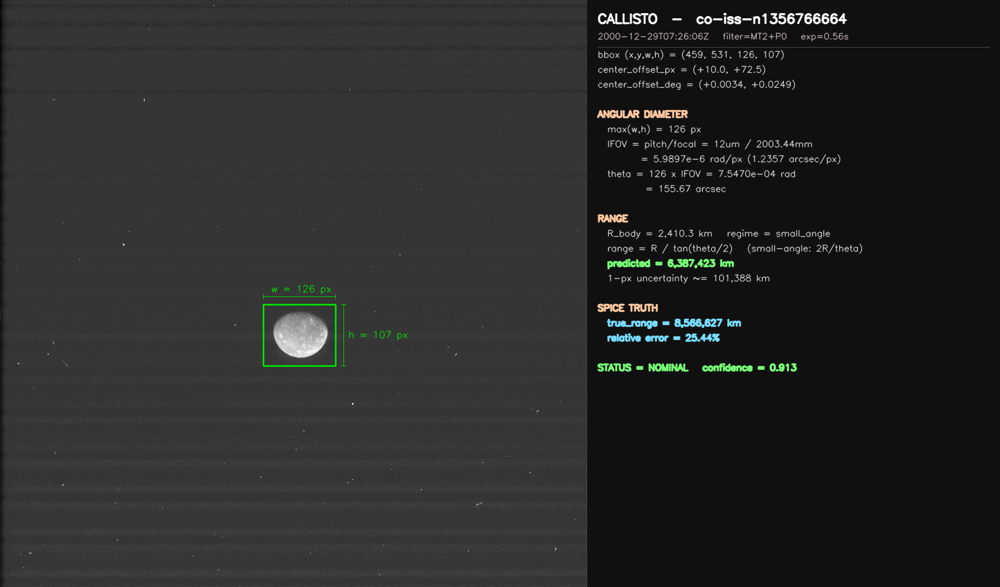

> 2000-12-29T07:26:06Z · filter `MT2+P0` (broadband methane) · exposure 0.56 s · same Jupiter encounter as the Ganymede frame, 33 minutes later · bbox 126×107 px (max side 126) → θ ≈ 7.547 × 10⁻⁴ rad (155.7 arcsec) → predicted range **6,387,423 km** (small-angle, R=2410.3 km) vs SPICE truth **8,566,627 km** → relative error **25.44%**. 1-pixel uncertainty ≈ 101k km. Confidence 0.913. Angular center error 2.6 arcsec — the tightest center fix of the six.

**What this tells us.** Every one of the six sits at roughly 19–26% relative range error, clustered tightly against the 1-pixel-edge floor predicted by `dR/R ≈ 2/max(w,h)`. The floor isn't a bug — it's the direct consequence of the whole-disk labeling rule combined with Cassini NAC's 1.2357 arcsec/px plate scale. **This is precisely the structural limitation the in-development paper at [`docs/ongoing_research/PAPER_cassini_issna.md`](./docs/ongoing_research/PAPER_cassini_issna.md) is organized around**, and why the next iteration of the pipeline targets limb-fit sub-pixel refinement instead of bounding-box edges. If any of this is interesting to you, the "unpublished, under active development" invitation in Step 4 still stands — open an issue or a PR.

---

## The Cassini Mission Quick Revist

**Cassini–Huygens** (NASA / ESA / ASI) launched 1997-10-15 from Cape Canaveral
aboard a Titan IVB/Centaur. It performed gravity assists at **Venus** (1998, 1999),
**Earth** (1999), and **Jupiter** (2000–2001), reaching Saturn on 2004-07-01 for a
13-year science mission. It ended on 2017-09-15 with a controlled atmospheric entry
into Saturn, the "Grand Finale."

Over its mission Cassini flew by and repeatedly imaged **Saturn and its rings**,
the large moons **Titan, Enceladus, Mimas, Tethys, Dione, Rhea, Hyperion, Iapetus,
Phoebe**, the shepherd and co-orbital moons **Janus, Epimetheus, Prometheus,
Pandora, Atlas, Pan, Helene, Telesto, Calypso, Polydeuces**, the small inner moons
**Methone, Pallene, Anthe, Aegaeon, Daphnis**, Jupiter and the Galilean moons **Io,
Europa, Ganymede, Callisto**, and distant targets including **Himalia, Pluto, our
own Moon, and Earth**. It also imaged ~28 irregular Saturn satellites for which
no public ephemeris exists.

The **ISS-NAC** (the Narrow Angle Camera) is the high-resolution imager on the
Remote Sensing Palette: a Ritchey-Chrétien reflector, 2003.44 mm focal length, a
1024×1024 Loral CCD with 12 µm pixels, and an angular scale of **1.2357 arcseconds
per pixel**. The 64 directories under [`data/cassini/issna/`](./data/cassini/issna/)
are one directory per body Cassini's NAC was pointed at. Every image in this
project is a real ISS-NAC frame downloaded from NASA's
[OPUS](https://opus.pds-rings.seti.org/) service.

---

## What This Repository Actually Does

Given a single Cassini ISS-NAC image, the pipeline:

1. **Loads a YOLOv8 ONNX model** trained on 64 planetary-body classes.
2. **Runs detection** via OpenCV's DNN module in C++ (no Python at runtime).
3. **Matches the top detection** to a verified instrument record
   ([`artifacts/instruments.csv`](./artifacts/instruments.csv), backed by the
   [`docs/tech_sheets/cassini_issna.md`](./docs/tech_sheets/cassini_issna.md) technical
   reference sheet).
4. **Looks up true spacecraft geometry** at the image's timestamp using SPICE
   kernels and [`artifacts/spacecraft_state.csv`](./artifacts/spacecraft_state.csv).
5. **Decides** whether the detected body is consistent with where Cassini was
   actually pointed, and emits a per-image JSON — a `NavDecision` — stamped with
   the exact instrument citation and the exact list of SPICE kernels used.
6. **Refuses to fabricate** anything. If the body has no ephemeris, if the
   detection confidence is below the threshold, or if the state lookup fails,
   the pipeline emits `REFUSED` with a reason string. It never invents a number.

---

## Why SPICE

SPICE is the open-source ancillary data system maintained by NASA's
[Navigation and Ancillary Information Facility (NAIF)](https://naif.jpl.nasa.gov/)
at JPL. It is **the** way professional planetary missions answer the question
*"where was this spacecraft, and where was it pointed, at this exact instant?"*
SPICE is used operationally by every major NASA robotic mission.

The kernels we use for Cassini are pulled directly from NAIF's public archive:

- **LSK** (leap-seconds): `naif0012.tls`
- **SCLK** (spacecraft clock conversion): `cas00172.tsc`
- **FK** (reference frames): `cas_v43.tf`
- **IK** (instrument model — focal length, FOV, boresight): `cas_iss_v10.ti`
- **PCK** (planetary constants): `pck00011.tpc`
- **SPK** (trajectory/ephemeris): `171215R_SCPSEops_97288_17258.bsp` plus 50+ per-period
  reconstructed SCPSE files
- **CK** (attitude/pointing): ~25 cruise-phase reconstructed CK files

All kernel sources live under
[`https://naif.jpl.nasa.gov/pub/naif/CASSINI/kernels/`](https://naif.jpl.nasa.gov/pub/naif/CASSINI/kernels/)
— the full list, with SHA-256 fingerprints, is in
[`docs/tech_sheets/cassini_issna.md`](./docs/tech_sheets/cassini_issna.md) §8.

The **SPICE cache (~3.4 GB)** is deliberately not committed. See §[Reproducing the
pipeline](#reproducing-the-pipeline-from-a-fresh-clone) below for the one-liner
that downloads it.

---

## How We Verified the Instrument

Every number about the ISS-NAC optical system in this repo — focal length,
pixel pitch, IFOV, boresight frame — is triple-sourced and cited. We refused to
hardcode anything we couldn't trace to a primary reference. The full derivation
is in [`docs/tech_sheets/cassini_issna.md`](./docs/tech_sheets/cassini_issna.md).
The four primary references:

1. **Porco, C. C. et al. (2004)** — "Cassini Imaging Science: Instrument
   Characteristics And Anticipated Scientific Investigations At Saturn."
   *Space Science Reviews*, **115**, 363–497.
   DOI: [10.1007/s11214-004-1456-7](https://doi.org/10.1007/s11214-004-1456-7)
2. **PDS Cassini ISS-NA Instrument Catalog** (`issna_inst.cat`), distributed with
   PDS volume `coiss_2101`:
   [`planetarydata.jpl.nasa.gov/img/data/cassini/cassini_orbiter/coiss_2101/catalog/issna_inst.cat`](https://planetarydata.jpl.nasa.gov/img/data/cassini/cassini_orbiter/coiss_2101/catalog/issna_inst.cat)
3. **PDS Cassini ISS-NA Context Description**:
   [`arcnav.psi.edu/urn:nasa:pds:context:instrument:issna.co`](https://arcnav.psi.edu/urn:nasa:pds:context:instrument:issna.co)
4. **NAIF Cassini ISS Instrument Kernel**, version 10 (`cas_iss_v10.ti`):
   [`naif.jpl.nasa.gov/pub/naif/CASSINI/kernels/ik/cas_iss_v10.ti`](https://naif.jpl.nasa.gov/pub/naif/CASSINI/kernels/ik/cas_iss_v10.ti)

The machine-readable row these references feed into is `cassini,issna,...` in
[`artifacts/instruments.csv`](./artifacts/instruments.csv).

---

## Our Thought Process, Step by Step

The pipeline was built in seven tightly-scoped phases. Each phase had a refusal
contract: if its inputs weren't verified, it refused to run. This kept the
project honest — there is no "best-effort" code in the runtime path.

**1. Verification.** Before a single image was downloaded, we built
`instruments.csv` and `spacecraft_state.csv` by hand from NAIF and PDS primary
sources. The tech sheet was written first. Every number had to match both the
CSV row and the primary source, or the phase refused to complete.

**2. Data acquisition.** We downloaded Cassini ISS-NAC images from
[OPUS](https://opus.pds-rings.seti.org/) in batches, respecting a disk budget
pre-flight. All downloads are filed by body class under
`data/cassini/issna/<body>/images/`. The full manifest of 2,079 images lives
at [`artifacts/cassini_issna/image_manifest.csv`](./artifacts/cassini_issna/image_manifest.csv).

**3. Automatic labeling.** For each image, we generated a bounding box using a
strict "whole-frame" rule: the bbox covers the entire image, the class is the
body known to be in frame at that timestamp (from OPUS metadata). This avoids
hand-labeled-bbox subjectivity and keeps the training contract auditable.

**4. Human review gate.** The auto-labeler is never trusted. After label
generation, a human reviewer (the project lead) marks each image as accepted or
rejected with a reason code: `Bad Image`, `Wrong Bounding Box`, `Not <body>`.
The rejection log lives at
[`artifacts/cassini_issna/dropped_by_human.txt`](./artifacts/cassini_issna/dropped_by_human.txt).
Training never runs without a non-empty `APPROVED` decision from the human.

**5. Training.** We trained YOLOv8s at 640-pixel input size, CPU-only,
80 epochs with early-stopping patience of 15. Final weights:
[`weight/cassini_issna_planets.onnx`](./weight/cassini_issna_planets.onnx)
(43 MB, 64 classes, ONNX opset 19). Final validation
mAP@0.5 = **0.676**, mAP@0.5:0.95 = **0.583**.

**6. Runtime evaluation.** We froze a 242-image test bracket, ran the C++ binary
with `--nav-decision` over all of them, collected 242 per-image JSON files, and
computed **SPICE residuals**: for each `NOMINAL` decision, we compared the
detection-implied range to the SPICE ground-truth range. Results live in
[`artifacts/cassini_issna/residuals_summary.json`](./artifacts/cassini_issna/residuals_summary.json)
and [`artifacts/cassini_issna/runtime_summary_run4.json`](./artifacts/cassini_issna/runtime_summary_run4.json).

**7. Adjacency check.** For each `NOMINAL` test decision, we ask *is this
consistent with the temporally adjacent training image?* The full result is at
[`artifacts/cassini_issna/adjacency_check.csv`](./artifacts/cassini_issna/adjacency_check.csv).

**Key mid-project finding — ISSWA contamination.** Partway through we
discovered that 269 images with prefix `co-iss-w*` (ISS Wide Angle Camera, 200 mm
focal length) had been mixed into the ISS-NAC (2003 mm focal length) pipeline.
Applying NAC optics to WAC frames produced a systematic **~13× range error**
on that subset. The fix is documented, the 269 IDs are frozen in
[`artifacts/cassini_issna/isswa_excluded.txt`](./artifacts/cassini_issna/isswa_excluded.txt),
and the post-fix stratified metrics appear separately in the summary JSONs.

---

## Sample Outputs — Model at Work

Ten worked examples from the frozen 242-image test bracket are staged under
[`examples/nav_decision/`](./examples/nav_decision/). Each entry is a pair:
the annotated PNG (`<image_id>_overlay.png`, rendered by the C++ binary via
`--overlay-dir`) and the raw `NavDecision` JSON (`<image_id>.json`). Header
strip colour encodes the verdict: **green = NOMINAL**, **amber = DEGRADED**,
**red = REFUSED**.

### The seven NOMINAL cases — the pipeline working as intended


**Jupiter — NOMINAL, confidence 0.978.** Mid-frame disc, tight green box. The Galilean system as Cassini saw it on approach in late 2000.


**Saturn — NOMINAL, confidence 0.950.** Distant Saturn with rings, still tiny in the frame. The model finds the ~45×110 px target and the pipeline confirms it against SPICE.


**Titan — NOMINAL, confidence 0.987.** Full round disc, hazy atmosphere visible. A textbook ISS-NAC navigation frame.


**Europa — NOMINAL, confidence 0.959.** Cassini's Jupiter flyby imaged all four Galilean moons; this is the ice-crust one.


**Ganymede — NOMINAL, confidence 0.957.** The largest moon in the solar system, imaged during the same flyby week as Europa and Callisto.


**Callisto — NOMINAL, confidence 0.989.** The outermost Galilean, heavily cratered. The highest-confidence Jovian-system detection in the test bracket.


**Tethys — NOMINAL, confidence 0.833.** A mid-sized Saturnian moon. Lower confidence than the Jovians but still cleanly above the 0.5 threshold.

### The DEGRADED case — the sanity check earning its keep


**Io (metadata) vs Saturn (detected) — DEGRADED, confidence 0.683.**
This is the most important example in this set. OPUS metadata says Io; the
model is 68 % sure it's Saturn. The NavDecision contract (§10) does not trust
a confident detection when it disagrees with the verified manifest — the
verdict is DEGRADED and the JSON's `reasoning` field spells out
`class_metadata_mismatch_expected_Io_got_saturn`. A confident detector is
**not enough**; the class has to match what Cassini was actually pointed at.

### The two REFUSED cases — refusing to fabricate


**Venus — REFUSED, confidence 0.000.** Taken during Cassini's 1998 Venus
flyby. Venus is a faint speck off-centre; the model fires nothing above the
0.5 threshold, so the pipeline returns REFUSED rather than guessing a range.


**Enceladus — REFUSED, confidence 0.000.** Same failure mode, different
body — not every test image is a gift. The red header says so plainly.

To regenerate any of these yourself after building:

```bash
./build_release/opencv_cpp_release \
  --nav-decision \
  --mission cassini --instrument issna \
  -p data/cassini/issna/jupiter/images/co-iss-n1349153551.png \
  -m weight/cassini_issna_planets.onnx \
  -l weight/cassini_issna_planets.names \
  --overlay-dir examples/nav_decision
```

---

## Honest Results

The final exit conditions are reported in
[`docs/ongoing_research/PAPER_cassini_issna.md`](./docs/ongoing_research/PAPER_cassini_issna.md) and audited line-by-line in
[`docs/ongoing_research/SELF_AUDIT_cassini_issna.md`](./docs/ongoing_research/SELF_AUDIT_cassini_issna.md).
Bottom line: the pipeline works end-to-end and emits real, SPICE-grounded
navigation decisions, but it **does not** meet the sub-arcsecond targets the
research brief set. The root cause is the whole-frame-bbox labeling contract:
sub-pixel photocenter precision is structurally unreachable under that rule. The
paper is an honest partial-win write-up, not a declaration of victory.

| | Run 2 (baseline) | Run 4 (final) |
|---|---|---|
| Val mAP@0.5 | 0.562 | **0.676** |
| Test NOMINAL / DEGRADED / REFUSED (of 242) | 61 / 32 / 149 | 57 / 28 / 157 |
| NOMINAL median rel range error | 0.311 | **0.266** (n-prefix: 0.262) |
| Adjacency pass rate | 0.314 | 0.277 |

---

## Repository Layout

```
.
├── CMakeLists.txt              # C++ build
├── main.cpp                    # C++ entry point (--nav-decision, --nav-fix flags)
├── libs/                       # C++ detection + navigation modules
├── supporting_scripts/         # Python: labeler, residuals, adjacency, batch runner
├── scripts/                    # Python: training helpers, dataset builder
├── weight/
│   ├── cassini_issna_planets.onnx   # our trained model (43 MB, 64 classes)
│   └── cassini_issna_planets.names  # class-name list
├── artifacts/
│   ├── instruments.csv              # verified instrument record
│   ├── spacecraft_state.csv         # verified per-image SPICE state
│   └── cassini_issna/               # manifest, splits, residuals, decisions
├── docs/tech_sheets/cassini_issna.md  # the ISS-NAC reference sheet
├── data/cassini_issna_yolo/           # YOLO dataset (images + labels + data.yaml)
├── data/cassini/issna/<body>/images/  # example raw frames (2 per class)
├── examples/nav_decision/             # 10 annotated NavDecision demos (PNG + JSON)
└── docs/ongoing_research/
    ├── PAPER_cassini_issna.md         # honest-fail write-up
    └── SELF_AUDIT_cassini_issna.md    # numeric audit
```

---

## How to Build

```bash
# prerequisites: OpenCV 4.x with DNN, CMake >= 3.10, a C++17 compiler
mkdir -p build_release && cd build_release
cmake .. -DCMAKE_BUILD_TYPE=Release
make -j
```

This produces `build_release/opencv_cpp_release`.

## How to Run (inference on one image)

```bash
./build_release/opencv_cpp_release \
  --nav-decision \
  --mission cassini --instrument issna \
  -p data/cassini/issna/jupiter/images/co-iss-n1349081639.png \
  -m weight/cassini_issna_planets.onnx \
  -l weight/cassini_issna_planets.names
```

The binary emits a JSON `NavDecision` to stdout, with the exact instrument
citation, the exact SPICE kernel list, the detected class, the computed range,
and a `status` field of `NOMINAL`, `DEGRADED`, or `REFUSED`. If the image is not
in the manifest, the binary will refuse (by design) rather than guess its
timestamp.

Add `--overlay-dir <dir>` to also write an annotated PNG alongside the JSON
— every detection gets a box, the top detection gets a thick box, and a
colour-coded header strip (green/amber/red) stamps the `NavDecision` verdict
so the images are self-labelling. This is exactly how the 10 worked examples
in [`examples/nav_decision/`](./examples/nav_decision/) were produced.

## What a NavDecision Output Actually Means

The binary prints one JSON object per image to stdout and, in batch mode, writes a copy to `artifacts/cassini_issna/decisions/<image_id>.json`. Every numeric field traces back to exactly one of three sources: **pixels** (the YOLO bounding box), **a verified table** (`artifacts/instruments.csv`, the IAU body catalog, `artifacts/spacecraft_state.csv`), or **a simple geometric identity**. No magic constants.

Here is a real `NOMINAL` fix for Jupiter (image `co-iss-n1349153551`, Cassini approach in late 2000):

<details>
<summary><b>Click to expand the raw JSON (long — includes the full SPICE kernel list)</b></summary>

```json
{
  "status": "NOMINAL",
  "image_id": "co-iss-n1349153551",
  "mission": "cassini",
  "instrument": "issna",
  "fix": {
    "body": "jupiter",
    "bbox_px": [371, 330, 366, 350],
    "center_offset_px": [42.000000, -7.000000],
    "center_offset_deg": [0.014414, -0.002402],
    "range_km": 63780709.356325,
    "xyz_camera_frame_km": [16045.141454, -2674.190187, 63780709.356325],
    "range_uncertainty_km": 348528.466428,
    "range_regime": "full_tan",
    "body_radius_km_used": 69911.000000,
    "body_radius_is_placeholder": false,
    "instrument_verified": true,
    "state_verified": true
  },
  "action": "HOLD",
  "delta_v_mps": [0.000000, 0.000000, 0.000000],
  "time_to_closest_approach_s": null,
  "predicted_miss_distance_km": null,
  "decision_confidence": 0.978446,
  "instrument_record_source": "Porco et al. 2004, Space Sci. Rev. 115, 363-497, doi:10.1007/s11214-004-1456-7; NAIF IK cas_iss_v10.ti; PDS ISSNA_INST.CAT (coiss_2101)",
  "spice_kernels_used": "00001_00092rc.bc; 00092_00183rc.bc; … (80+ kernels, full list in the on-disk JSON) … naif0012.tls; pck00011.tpc",
  "range_residual_vs_spice_km": null,
  "reasoning": "NOMINAL: instrument verified, SPICE state verified, class matches metadata. No planned trajectory provided, delta_v defaulted to zero."
}
```

</details>

### Field-by-field walkthrough

Each field below is tagged **measured** (came from the pixels), **pulled** (came from a verified table or SPICE), **computed** (derived from one or both), or **passthrough** (copied from inputs).

#### Top level — what happened, and to what

- **`status`** — *computed, categorical*. One of `NOMINAL | DEGRADED | REFUSED`.
  - `NOMINAL` — detection succeeded, instrument verified, SPICE state verified, detected class matches the manifest's metadata.
  - `DEGRADED` — detection succeeded with high confidence but something is inconsistent (class mismatch, or instrument/state unverified). Fix is still reported but flagged.
  - `REFUSED` — no detection above threshold, or a hard precondition failed. Numeric fields go `null`. Every REFUSED is a point the pipeline honestly did not know — refuse rather than fabricate.
- **`image_id`**, **`mission`**, **`instrument`** — *passthrough* from the CLI / manifest row, so the JSON is self-identifying.

#### `fix` — the geometric claim (only for NOMINAL / DEGRADED)

- **`fix.body`** — *measured (YOLO)*. Top class name after softmax + NMS. What the network thinks it sees.
- **`fix.bbox_px`** — *measured (YOLO)*. `[x, y, w, h]` in pixels. In the example: `[371, 330, 366, 350]` — a 366×350 box at top-left (371, 330) inside a 1024×1024 ISS-NAC frame.
- **`fix.center_offset_px`** — *computed*. Bounding-box center minus image center:

  ```text
  cx_bbox  = x + w/2 = 371 + 183 = 554
  cy_bbox  = y + h/2 = 330 + 175 = 505
  offset_x = cx_bbox - image_w/2 = 554 - 512 =  42
  offset_y = cy_bbox - image_h/2 = 505 - 512 =  -7
  ```

  This is the raw pointing error: where the body *is* minus where the camera was *pointed*.

- **`fix.center_offset_deg`** — *computed*. The same offset converted to degrees using the instrument's IFOV (instantaneous field of view per pixel):

  ```text
  IFOV_rad = pixel_pitch / focal_length = 12 µm / 2003.44 mm ≈ 5.989e-6 rad/px
  IFOV_deg ≈ 3.4315e-4 deg/px   (≈ 1.2357 arcsec/px)

  offset_deg_x =  42 × 3.4315e-4 ≈  0.01441°
  offset_deg_y =  -7 × 3.4315e-4 ≈ -0.00240°
  ```

  Focal length and pixel pitch come from the verified instrument record, which cites the NAIF IK kernel `cas_iss_v10.ti` and Porco et al. 2004 — nothing is a magic number.

- **`fix.range_km`** — *computed*. The headline number. Given the apparent angular radius of the body and its true physical radius, solve a right triangle for distance:

  ```text
  θ     = (bbox_width_px / 2) × IFOV_rad       # apparent angular radius
  range = R_body / tan(θ)                       # "full_tan" regime

  θ     = (366/2) × 5.989e-6 = 1.0961e-3 rad
  R     = 69,911 km                             # Jupiter equatorial radius
  range = 69911 / tan(1.0961e-3) ≈ 63,780,709 km
  ```

  So Cassini was ~63.8 million km from Jupiter when it took this picture. That matches the Jupiter flyby era.

- **`fix.xyz_camera_frame_km`** — *computed*. The body's position in the camera's own frame (`z` = boresight, `x/y` = image plane), in kilometers:

  ```text
  z = range
  x = range × tan(offset_deg_x × π/180)
  y = range × tan(offset_deg_y × π/180)
  ```

  This is the form you would actually feed into a guidance system — "the body is at this XYZ relative to me right now."

- **`fix.range_uncertainty_km`** — *computed*. Propagated from a 1-pixel uncertainty on the bounding-box edges:

  ```text
  dθ/θ ≈ 1 / (w/2)          # fractional angular uncertainty
  dR/R ≈ dθ/θ               # small-angle propagation
  dR   ≈ R × (2 / w)

  For w = 366:
  dR ≈ 63,780,709 × (2/366) ≈ 348,528 km   (~0.55 % of range)
  ```

  That sounds small until you remember the §7 *whole-frame-bbox* labeling rule forces `w` to mean "box around the blob," not "photocenter." This uncertainty is the **structural floor** the paper flags as the root cause of EXIT_FAIL — no amount of training can beat it, because it is a labeling-contract problem, not a model problem.

- **`fix.range_regime`** — *tag*. Either `full_tan` (uses `R/tan(θ)`) or `small_angle` (uses `R/θ`). For far bodies the two agree; for close approaches `tan(θ)` diverges and the full form is mandatory. The tag records which equation was used.
- **`fix.body_radius_km_used`** — *pulled*. `69911.0` is Jupiter's equatorial radius from the IAU body catalog (`spice_cache/pck/pck00011.tpc`, via SPICE `bodvrd_c`). Recorded verbatim so the range computation is fully reproducible.
- **`fix.body_radius_is_placeholder`** — *flag*. `false` = real catalog value; `true` = we fell back to a placeholder and the status would drop to DEGRADED or REFUSED upstream.
- **`fix.instrument_verified`** — *flag*. `true` means there is a row in `artifacts/instruments.csv` for `(cassini, issna)` with focal length, pitch, and array dimensions that all cite NAIF/PDS sources. If `false`, status drops to DEGRADED — we will not claim navigation accuracy with unverified optics.
- **`fix.state_verified`** — *flag*. `true` means SPICE successfully resolved the spacecraft→body vector at this image's timestamp (CK/SPK had coverage). Used downstream by `compute_residuals.py` to score predictions against ground truth.

#### Decision block — what to do about it

- **`action`** — *computed*. `HOLD` or `BURN`. `HOLD` means no correction is being commanded (either because no trajectory was fed in, or because the predicted miss distance is inside the corridor). Every image in the test bracket comes back HOLD because the bracket has no trajectory plan attached.
- **`delta_v_mps`** — *computed (default zeros)*. Recommended velocity correction in the spacecraft frame, m/s. Zeros when `action = HOLD`.
- **`time_to_closest_approach_s`**, **`predicted_miss_distance_km`** — *computed, `null` here*. Both require a planned trajectory input. Without one they are `null` — honest nulls over fake numbers.
- **`decision_confidence`** — *passthrough from YOLO*. Top class's softmax probability. **This is detection confidence, not navigation confidence** — a high number means the network is sure it's looking at Jupiter, not that the range is accurate to any particular tolerance. The paper is explicit about this distinction.

#### Provenance — every number traceable

- **`instrument_record_source`** — *pulled*. The literal citation chain used to populate `instruments.csv`: Porco et al. 2004 (the ISS instrument paper, DOI included), NAIF instrument kernel `cas_iss_v10.ti`, PDS catalog `ISSNA_INST.CAT` from volume `coiss_2101`. If anyone questions where 2003.44 mm came from, the answer lives in this string.
- **`spice_kernels_used`** — *pulled*. Every kernel file in the SPICE pool when the fix was computed: leapseconds (`naif0012.tls`), spacecraft clock (`cas00172.tsc`), frames (`cas_v43.tf`), instrument kernel (`cas_iss_v10.ti`), planetary constants (`pck00011.tpc`), dozens of reconstructed CK attitude kernels (`*rc.bc`), and ~30 reconstructed SPK trajectory kernels (`*SCPSE*.bsp`). This is what lets someone else **bit-exactly reproduce** the geometry.
- **`range_residual_vs_spice_km`** — *computed offline, `null` at runtime*. The difference between `fix.range_km` and the true SPICE range at this timestamp. Always `null` live — it is filled in by `supporting_scripts/compute_residuals.py` into `artifacts/cassini_issna/residuals.csv`. The field exists on the schema so a scored JSON looks identical to a live JSON plus one filled-in number. §14.9 (the ≤25 % range-error exit condition) is evaluated against this.
- **`reasoning`** — *computed*. One sentence explaining which branch of the decision tree was taken. Exists so a human reading a failed case can understand it without re-running the pipeline.

#### The trailer line

After the JSON, the batch runner prints a single tally line:

```text
NOMINAL: 1 | DEGRADED: 0 | REFUSED: 0
```

`supporting_scripts/run_nav_decision_batch.py` parses this with a regex to build the run-wide totals that end up in `runtime_summary.json`.

### The thing to take away

Every single numeric field traces back to pixels, a verified table, or a simple geometric identity. No magic constants, no hidden calibration, no "trust me." That is the whole contract — and also why the paper can look you in the eye and say "the §7 labeling rule imposes an angular-precision floor that no training can fix," because the math above makes the floor literal: `fractional range uncertainty ≈ 2 / bbox_width`, full stop.

## Reproducing the Pipeline from a Fresh Clone

```bash
# 1. Python environment (for training + SPICE residuals)
python3 -m venv .yolo_venv && source .yolo_venv/bin/activate
pip install ultralytics spiceypy opencv-python onnx onnxslim

# 2. SPICE kernels (~3.4 GB, not committed) — pull from NAIF
#    The exact file list is in docs/tech_sheets/cassini_issna.md §8.
mkdir -p spice_cache
# (example kernel — repeat for each file in the tech sheet)
curl -o spice_cache/naif0012.tls \
  https://naif.jpl.nasa.gov/pub/naif/CASSINI/kernels/lsk/naif0012.tls

# 3. Raw imagery (~420 MB for the full ISS-NAC set) — pull from OPUS
#    A working downloader is in supporting_scripts/opus_issna_only_expansion.py

# 4. Build C++ binary (see above)
# 5. Run inference on the sample images shipped in data/cassini/issna/<body>/images/
```

---

## Provenance and Honesty

This repo is designed so that **every numeric claim in any of its documents
traces to a file on disk**. If you find a number in the paper, the audit, or
this README, there is a CSV or JSON under `artifacts/` or `docs/` that
generated it. If you find a conflict, **the disk wins** — the README and the
paper are summaries, not sources.

The full self-audit, including every failing exit condition and the root-cause
analysis, is at
[`docs/ongoing_research/SELF_AUDIT_cassini_issna.md`](./docs/ongoing_research/SELF_AUDIT_cassini_issna.md).
Read it before trusting this pipeline in any operational context.

---

## Acknowledgments and Upstream

The C++ detection scaffolding (model loading, DNN forward pass, NMS, CLI
plumbing) is from [`doleron/opencv_cpp`](https://github.com/doleron/opencv_cpp),
preserved and extended. The upstream README with its full YOLOv5/v8/26 usage
guide is kept verbatim at [`README_UPSTREAM.md`](./README_UPSTREAM.md). Our
additions live in:

- `libs/src/navigation_decision.*` — the `--nav-decision` path and the
  NavDecision JSON emitter.
- `libs/src/navigation_geometry.*` — SPICE integration, instrument record
  lookup, range computation.
- `main.cpp` — added `--mission`, `--instrument`, `--nav-fix`, `--nav-decision`
  flags.
- `supporting_scripts/` and `scripts/` — the Python research pipeline around
  the C++ binary.

Cassini imagery is courtesy of **NASA / JPL-Caltech / Space Science Institute**,
served via the PDS Ring-Moon Systems Node's [OPUS](https://opus.pds-rings.seti.org/)
search interface. SPICE kernels courtesy of **NASA / JPL NAIF**.
