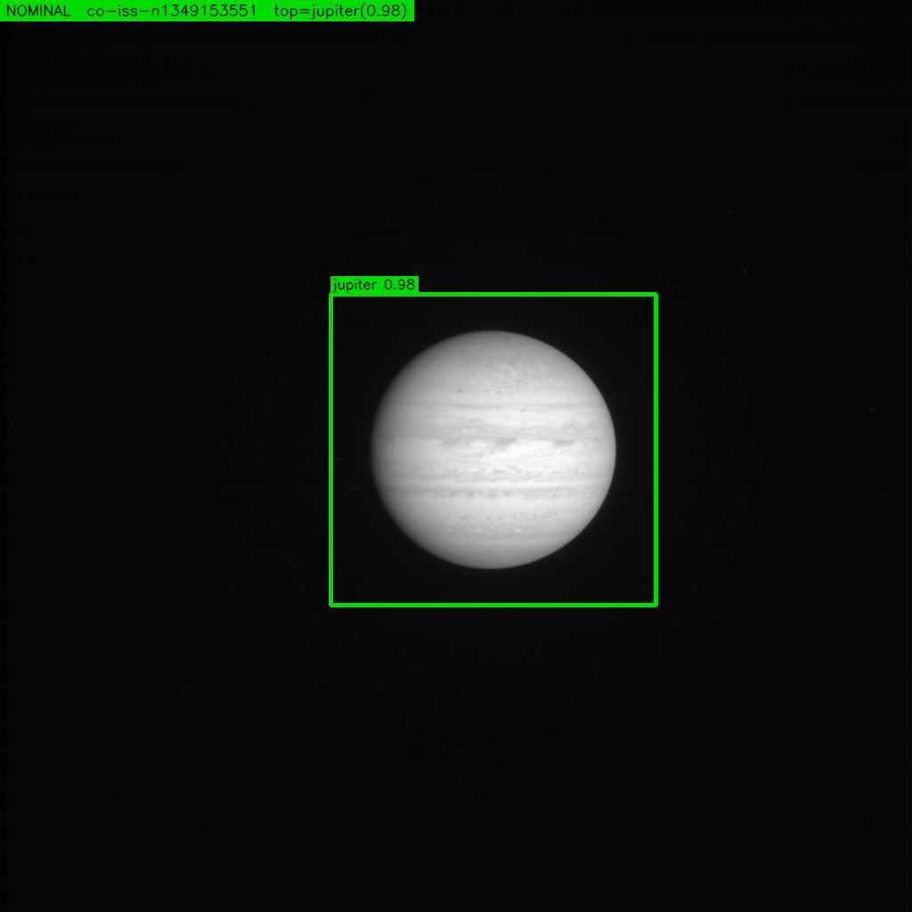
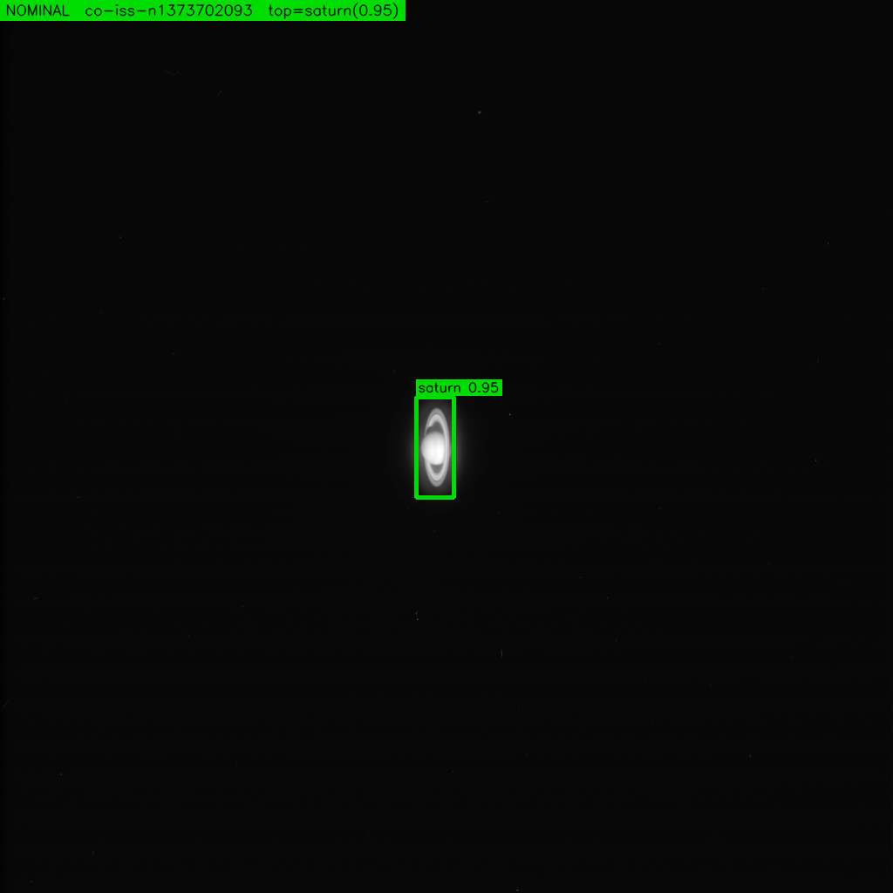
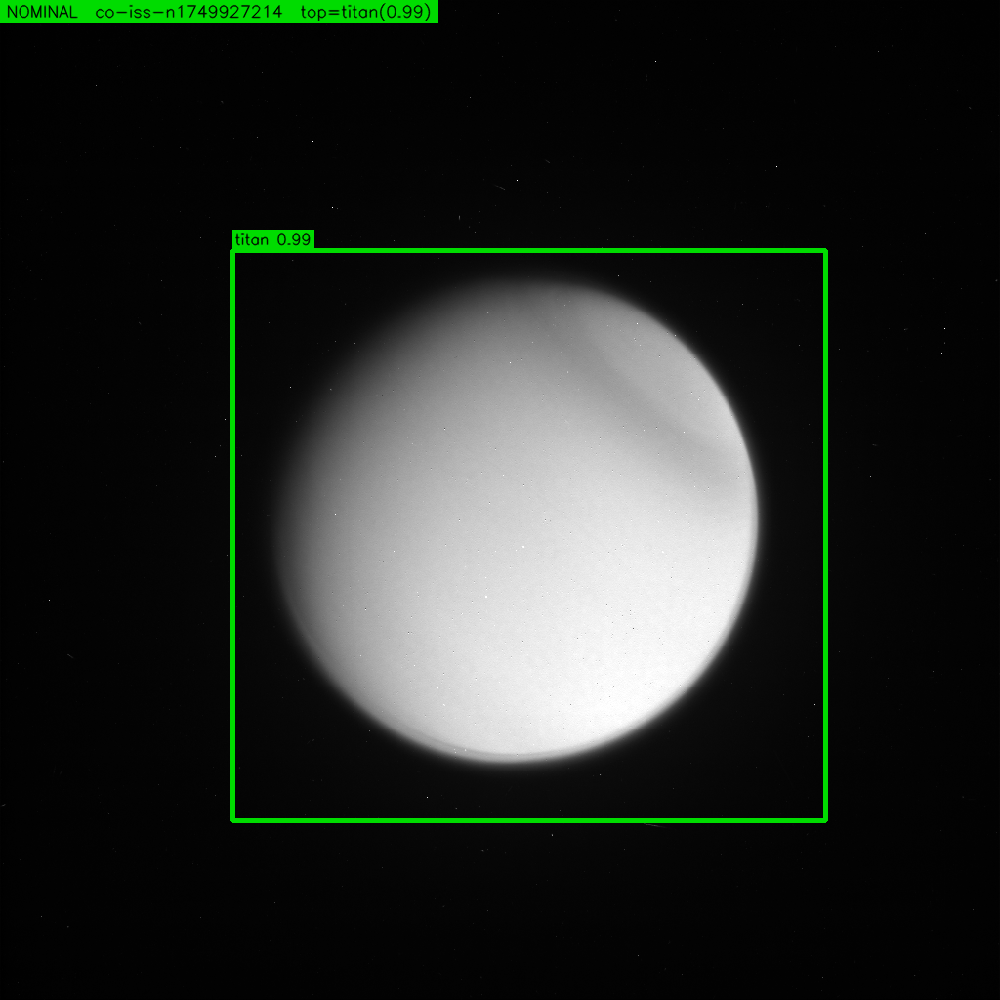
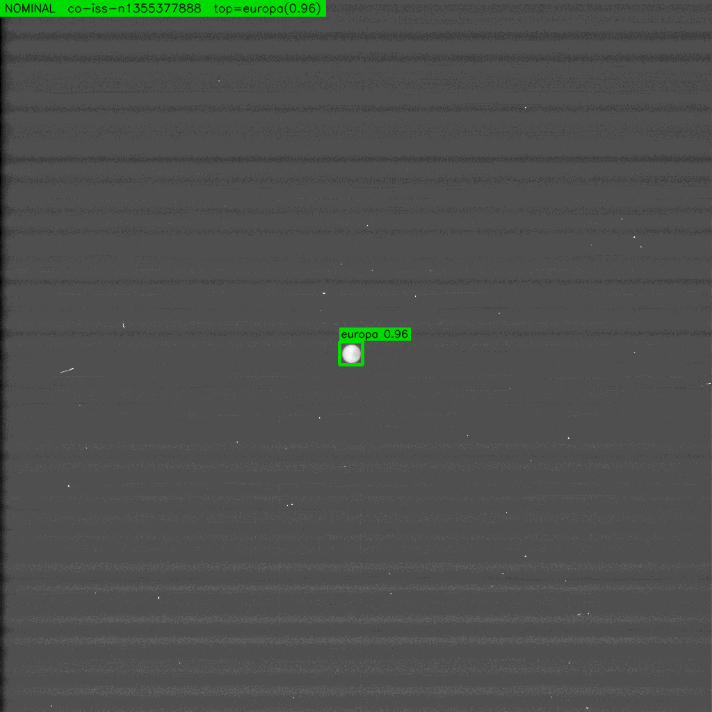
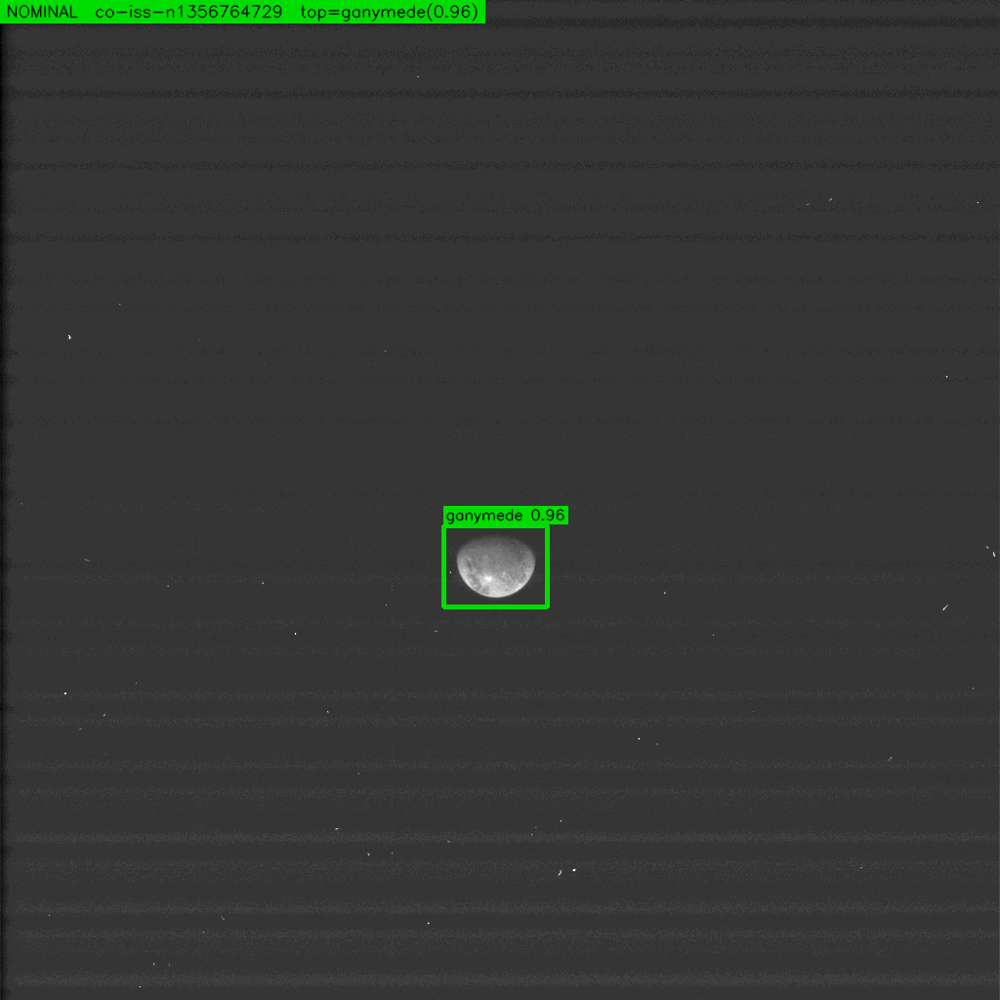
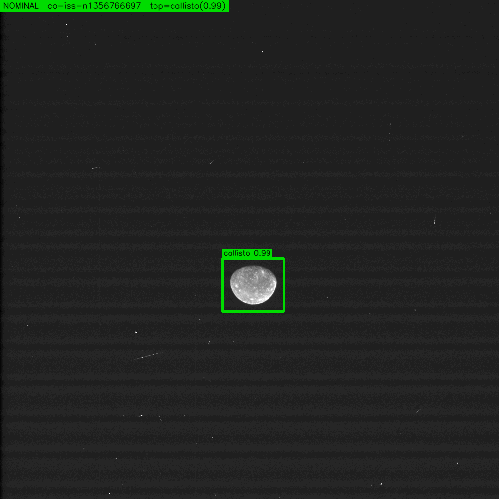
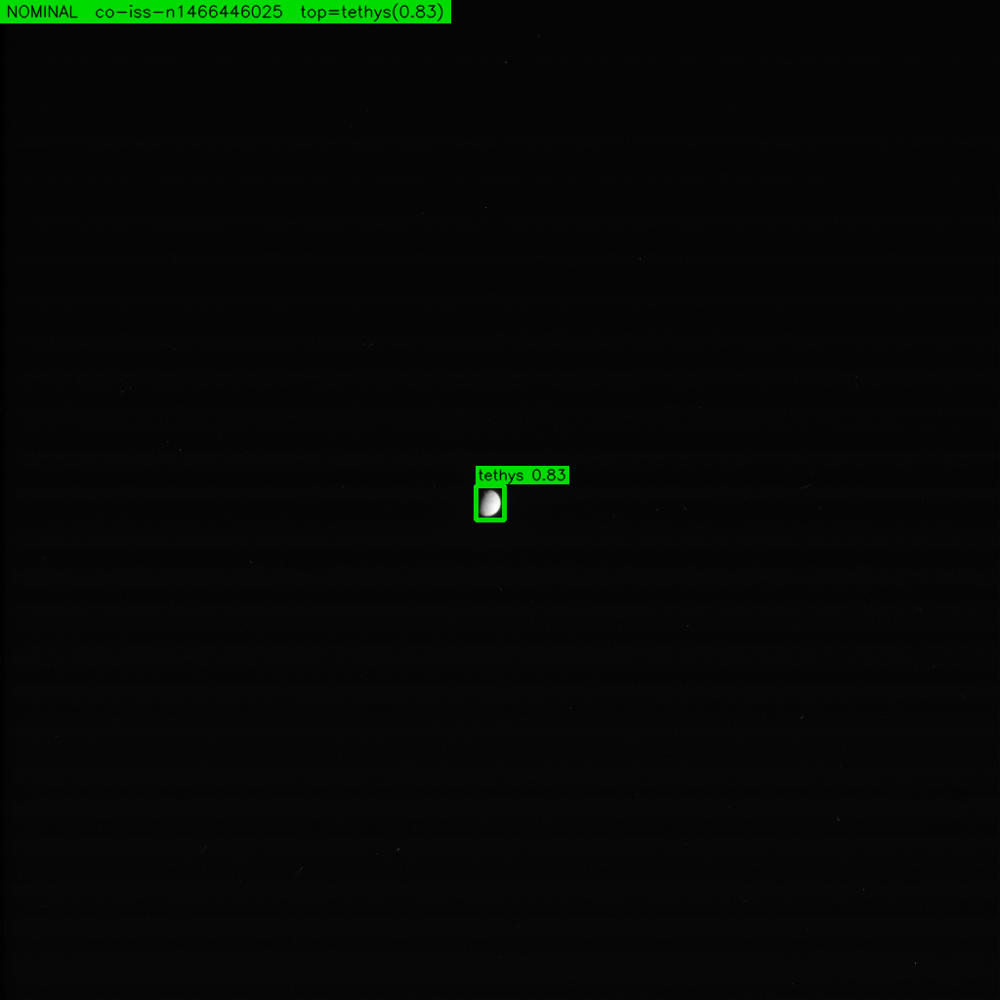
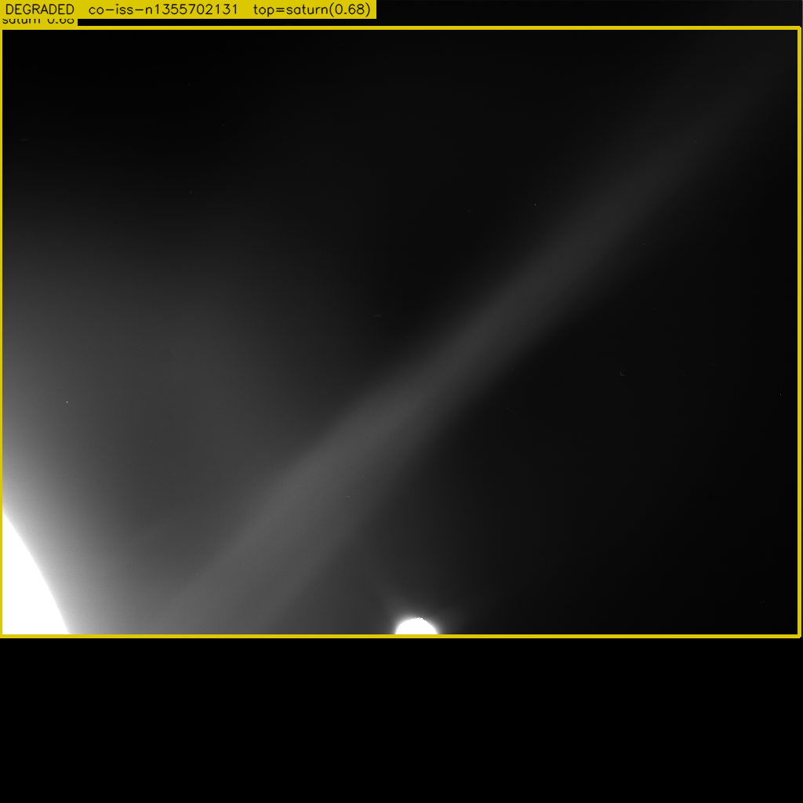
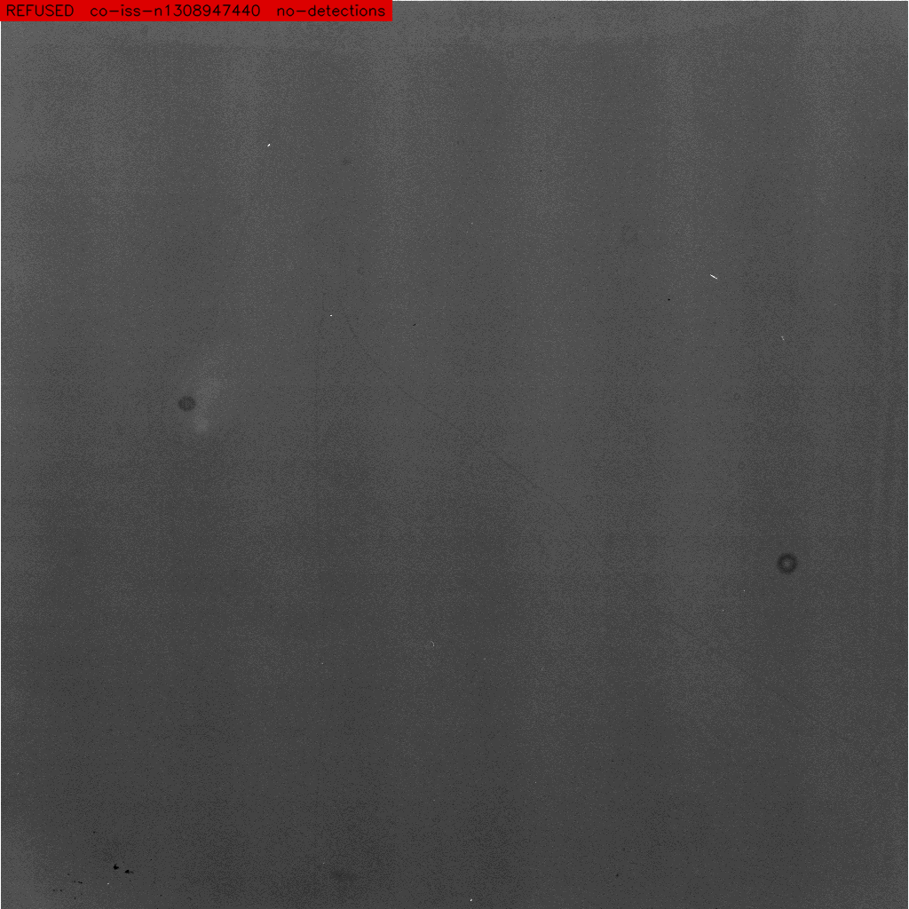
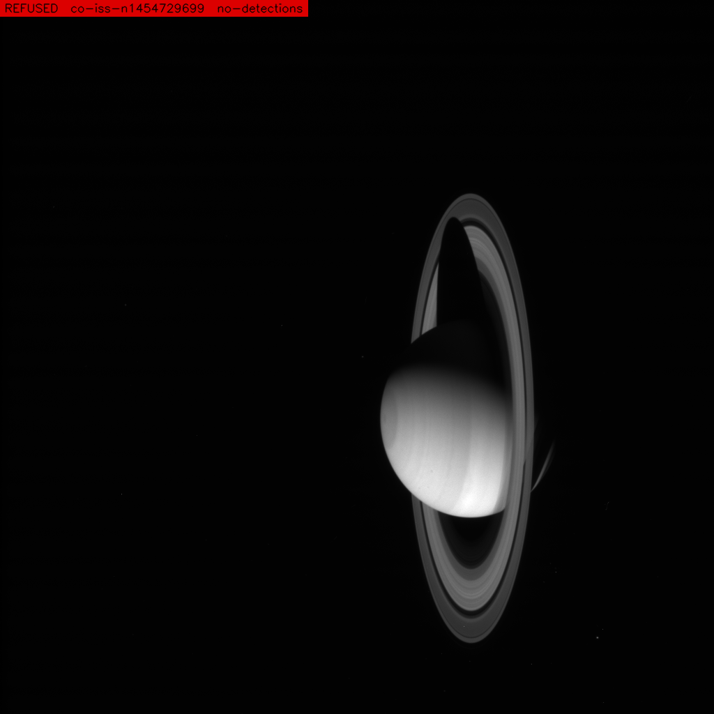

# Cassini ISS-NAC Navigation from YOLO Detection — an ICES Research Pipeline

This project teaches a YOLOv8 detector to recognize planetary bodies in real Cassini
Imaging Science Subsystem Narrow Angle Camera (ISS-NAC) frames, and then uses that
detection together with verified spacecraft geometry (from JPL's SPICE toolkit) to
produce a per-image **navigation decision**: `NOMINAL`, `DEGRADED`, or `REFUSED`.
The goal is an end-to-end, citation-bound demonstration that a small vision model
can participate in spacecraft navigation **without fabricating numbers** — every
range, every residual, every refusal has a traceable source.

This repository is **built on top of**
[`doleron/opencv_cpp`](https://github.com/doleron/opencv_cpp),
a production-ready C++ / OpenCV DNN YOLO inference project. The upstream README is
preserved verbatim as [`README_UPSTREAM.md`](./README_UPSTREAM.md). Everything in
this README is the research layer we added on top: mission-specific verification,
labeling, training, SPICE-linked runtime, and an honest-fail evaluation.

---

## The Cassini Mission in Three Paragraphs

**Cassini–Huygens** (NASA / ESA / ASI) launched 1997-10-15 from Cape Canaveral
aboard a Titan IVB/Centaur. It performed gravity assists at **Venus** (1998, 1999),
**Earth** (1999), and **Jupiter** (2000–2001), reaching Saturn on 2004-07-01 for a
13-year science mission. It ended on 2017-09-15 with a controlled atmospheric entry
into Saturn — the "Grand Finale."

Over its mission Cassini flew by and repeatedly imaged **Saturn and its rings**,
the large moons **Titan, Enceladus, Mimas, Tethys, Dione, Rhea, Hyperion, Iapetus,
Phoebe**, the shepherd and co-orbital moons **Janus, Epimetheus, Prometheus,
Pandora, Atlas, Pan, Helene, Telesto, Calypso, Polydeuces**, the small inner moons
**Methone, Pallene, Anthe, Aegaeon, Daphnis**, Jupiter and the Galilean moons **Io,
Europa, Ganymede, Callisto**, and distant targets including **Himalia, Pluto, our
own Moon, and Earth**. It also imaged ~28 irregular Saturn satellites for which
no public ephemeris exists.

The **ISS-NAC** (the Narrow Angle Camera) is the high-resolution imager on the
Remote Sensing Palette: a Ritchey-Chrétien reflector, 2003.44 mm focal length, a
1024×1024 Loral CCD with 12 µm pixels, and an angular scale of **1.2357 arcseconds
per pixel**. The 64 directories under [`data/cassini/issna/`](./data/cassini/issna/)
are one directory per body Cassini's NAC was pointed at. Every image in this
project is a real ISS-NAC frame downloaded from NASA's
[OPUS](https://opus.pds-rings.seti.org/) service.

---

## What This Repository Actually Does

Given a single Cassini ISS-NAC image, the pipeline:

1. **Loads a YOLOv8 ONNX model** trained on 64 planetary-body classes.
2. **Runs detection** via OpenCV's DNN module in C++ (no Python at runtime).
3. **Matches the top detection** to a verified instrument record
   ([`artifacts/instruments.csv`](./artifacts/instruments.csv), backed by the
   [`docs/tech_sheets/cassini_issna.md`](./docs/tech_sheets/cassini_issna.md) technical
   reference sheet).
4. **Looks up true spacecraft geometry** at the image's timestamp using SPICE
   kernels and [`artifacts/spacecraft_state.csv`](./artifacts/spacecraft_state.csv).
5. **Decides** whether the detected body is consistent with where Cassini was
   actually pointed, and emits a per-image JSON — a `NavDecision` — stamped with
   the exact instrument citation and the exact list of SPICE kernels used.
6. **Refuses to fabricate** anything. If the body has no ephemeris, if the
   detection confidence is below the threshold, or if the state lookup fails,
   the pipeline emits `REFUSED` with a reason string. It never invents a number.

---

## Why SPICE

SPICE is the open-source ancillary data system maintained by NASA's
[Navigation and Ancillary Information Facility (NAIF)](https://naif.jpl.nasa.gov/)
at JPL. It is **the** way professional planetary missions answer the question
*"where was this spacecraft, and where was it pointed, at this exact instant?"*
SPICE is used operationally by every major NASA robotic mission.

The kernels we use for Cassini are pulled directly from NAIF's public archive:

- **LSK** (leap-seconds): `naif0012.tls`
- **SCLK** (spacecraft clock conversion): `cas00172.tsc`
- **FK** (reference frames): `cas_v43.tf`
- **IK** (instrument model — focal length, FOV, boresight): `cas_iss_v10.ti`
- **PCK** (planetary constants): `pck00011.tpc`
- **SPK** (trajectory/ephemeris): `171215R_SCPSEops_97288_17258.bsp` plus 50+ per-period
  reconstructed SCPSE files
- **CK** (attitude/pointing): ~25 cruise-phase reconstructed CK files

All kernel sources live under
[`https://naif.jpl.nasa.gov/pub/naif/CASSINI/kernels/`](https://naif.jpl.nasa.gov/pub/naif/CASSINI/kernels/)
— the full list, with SHA-256 fingerprints, is in
[`docs/tech_sheets/cassini_issna.md`](./docs/tech_sheets/cassini_issna.md) §8.

The **SPICE cache (~3.4 GB)** is deliberately not committed. See §[Reproducing the
pipeline](#reproducing-the-pipeline-from-a-fresh-clone) below for the one-liner
that downloads it.

---

## How We Verified the Instrument

Every number about the ISS-NAC optical system in this repo — focal length,
pixel pitch, IFOV, boresight frame — is triple-sourced and cited. We refused to
hardcode anything we couldn't trace to a primary reference. The full derivation
is in [`docs/tech_sheets/cassini_issna.md`](./docs/tech_sheets/cassini_issna.md).
The four primary references:

1. **Porco, C. C. et al. (2004)** — "Cassini Imaging Science: Instrument
   Characteristics And Anticipated Scientific Investigations At Saturn."
   *Space Science Reviews*, **115**, 363–497.
   DOI: [10.1007/s11214-004-1456-7](https://doi.org/10.1007/s11214-004-1456-7)
2. **PDS Cassini ISS-NA Instrument Catalog** (`issna_inst.cat`), distributed with
   PDS volume `coiss_2101`:
   [`planetarydata.jpl.nasa.gov/img/data/cassini/cassini_orbiter/coiss_2101/catalog/issna_inst.cat`](https://planetarydata.jpl.nasa.gov/img/data/cassini/cassini_orbiter/coiss_2101/catalog/issna_inst.cat)
3. **PDS Cassini ISS-NA Context Description**:
   [`arcnav.psi.edu/urn:nasa:pds:context:instrument:issna.co`](https://arcnav.psi.edu/urn:nasa:pds:context:instrument:issna.co)
4. **NAIF Cassini ISS Instrument Kernel**, version 10 (`cas_iss_v10.ti`):
   [`naif.jpl.nasa.gov/pub/naif/CASSINI/kernels/ik/cas_iss_v10.ti`](https://naif.jpl.nasa.gov/pub/naif/CASSINI/kernels/ik/cas_iss_v10.ti)

The machine-readable row these references feed into is `cassini,issna,...` in
[`artifacts/instruments.csv`](./artifacts/instruments.csv).

---

## Our Thought Process, Step by Step

The pipeline was built in seven tightly-scoped phases. Each phase had a refusal
contract: if its inputs weren't verified, it refused to run. This kept the
project honest — there is no "best-effort" code in the runtime path.

**1. Verification.** Before a single image was downloaded, we built
`instruments.csv` and `spacecraft_state.csv` by hand from NAIF and PDS primary
sources. The tech sheet was written first. Every number had to match both the
CSV row and the primary source, or the phase refused to complete.

**2. Data acquisition.** We downloaded Cassini ISS-NAC images from
[OPUS](https://opus.pds-rings.seti.org/) in batches, respecting a disk budget
pre-flight. All downloads are filed by body class under
`data/cassini/issna/<body>/images/`. The full manifest of 2,079 images lives
at [`artifacts/cassini_issna/image_manifest.csv`](./artifacts/cassini_issna/image_manifest.csv).

**3. Automatic labeling.** For each image, we generated a bounding box using a
strict "whole-frame" rule: the bbox covers the entire image, the class is the
body known to be in frame at that timestamp (from OPUS metadata). This avoids
hand-labeled-bbox subjectivity and keeps the training contract auditable.

**4. Human review gate.** The auto-labeler is never trusted. After label
generation, a human reviewer (the project lead) marks each image as accepted or
rejected with a reason code: `Bad Image`, `Wrong Bounding Box`, `Not <body>`.
The rejection log lives at
[`artifacts/cassini_issna/dropped_by_human.txt`](./artifacts/cassini_issna/dropped_by_human.txt).
Training never runs without a non-empty `APPROVED` decision from the human.

**5. Training.** We trained YOLOv8s at 640-pixel input size, CPU-only,
80 epochs with early-stopping patience of 15. Final weights:
[`weight/cassini_issna_planets.onnx`](./weight/cassini_issna_planets.onnx)
(43 MB, 64 classes, ONNX opset 19). Final validation
mAP@0.5 = **0.676**, mAP@0.5:0.95 = **0.583**.

**6. Runtime evaluation.** We froze a 242-image test bracket, ran the C++ binary
with `--nav-decision` over all of them, collected 242 per-image JSON files, and
computed **SPICE residuals**: for each `NOMINAL` decision, we compared the
detection-implied range to the SPICE ground-truth range. Results live in
[`artifacts/cassini_issna/residuals_summary.json`](./artifacts/cassini_issna/residuals_summary.json)
and [`artifacts/cassini_issna/runtime_summary_run4.json`](./artifacts/cassini_issna/runtime_summary_run4.json).

**7. Adjacency check.** For each `NOMINAL` test decision, we ask *is this
consistent with the temporally adjacent training image?* The full result is at
[`artifacts/cassini_issna/adjacency_check.csv`](./artifacts/cassini_issna/adjacency_check.csv).

**Key mid-project finding — ISSWA contamination.** Partway through we
discovered that 269 images with prefix `co-iss-w*` (ISS Wide Angle Camera, 200 mm
focal length) had been mixed into the ISS-NAC (2003 mm focal length) pipeline.
Applying NAC optics to WAC frames produced a systematic **~13× range error**
on that subset. The fix is documented, the 269 IDs are frozen in
[`artifacts/cassini_issna/isswa_excluded.txt`](./artifacts/cassini_issna/isswa_excluded.txt),
and the post-fix stratified metrics appear separately in the summary JSONs.

---

## Sample Outputs — Model at Work

Ten worked examples from the frozen 242-image test bracket are staged under
[`examples/nav_decision/`](./examples/nav_decision/). Each entry is a pair:
the annotated PNG (`<image_id>_overlay.png`, rendered by the C++ binary via
`--overlay-dir`) and the raw `NavDecision` JSON (`<image_id>.json`). Header
strip colour encodes the verdict: **green = NOMINAL**, **amber = DEGRADED**,
**red = REFUSED**.

### The seven NOMINAL cases — the pipeline working as intended



**Jupiter — NOMINAL, confidence 0.978.** Mid-frame disc, tight green box. The Galilean system as Cassini saw it on approach in late 2000.



**Saturn — NOMINAL, confidence 0.950.** Distant Saturn with rings, still tiny in the frame. The model finds the ~45×110 px target and the pipeline confirms it against SPICE.



**Titan — NOMINAL, confidence 0.987.** Full round disc, hazy atmosphere visible. A textbook ISS-NAC navigation frame.



**Europa — NOMINAL, confidence 0.959.** Cassini's Jupiter flyby imaged all four Galilean moons; this is the ice-crust one.



**Ganymede — NOMINAL, confidence 0.957.** The largest moon in the solar system, imaged during the same flyby week as Europa and Callisto.



**Callisto — NOMINAL, confidence 0.989.** The outermost Galilean, heavily cratered. The highest-confidence Jovian-system detection in the test bracket.



**Tethys — NOMINAL, confidence 0.833.** A mid-sized Saturnian moon. Lower confidence than the Jovians but still cleanly above the 0.5 threshold.

### The DEGRADED case — the sanity check earning its keep



**Io (metadata) vs Saturn (detected) — DEGRADED, confidence 0.683.**
This is the most important example in this set. OPUS metadata says Io; the
model is 68 % sure it's Saturn. The NavDecision contract (§10) does not trust
a confident detection when it disagrees with the verified manifest — the
verdict is DEGRADED and the JSON's `reasoning` field spells out
`class_metadata_mismatch_expected_Io_got_saturn`. A confident detector is
**not enough**; the class has to match what Cassini was actually pointed at.

### The two REFUSED cases — refusing to fabricate



**Venus — REFUSED, confidence 0.000.** Taken during Cassini's 1998 Venus
flyby. Venus is a faint speck off-centre; the model fires nothing above the
0.5 threshold, so the pipeline returns REFUSED rather than guessing a range.



**Enceladus — REFUSED, confidence 0.000.** Same failure mode, different
body — not every test image is a gift. The red header says so plainly.

To regenerate any of these yourself after building:

```bash
./build_release/opencv_cpp_release \
  --nav-decision \
  --mission cassini --instrument issna \
  -p data/cassini/issna/jupiter/images/co-iss-n1349153551.png \
  -m weight/cassini_issna_planets.onnx \
  -l weight/cassini_issna_planets.names \
  --overlay-dir examples/nav_decision
```

---

## Honest Results

The final exit conditions are reported in
[`docs/ongoing_research/PAPER_cassini_issna.md`](./docs/ongoing_research/PAPER_cassini_issna.md) and audited line-by-line in
[`docs/ongoing_research/SELF_AUDIT_cassini_issna.md`](./docs/ongoing_research/SELF_AUDIT_cassini_issna.md).
Bottom line: the pipeline works end-to-end and emits real, SPICE-grounded
navigation decisions, but it **does not** meet the sub-arcsecond targets the
research brief set. The root cause is the whole-frame-bbox labeling contract:
sub-pixel photocenter precision is structurally unreachable under that rule. The
paper is an honest partial-win write-up, not a declaration of victory.

| | Run 2 (baseline) | Run 4 (final) |
|---|---|---|
| Val mAP@0.5 | 0.562 | **0.676** |
| Test NOMINAL / DEGRADED / REFUSED (of 242) | 61 / 32 / 149 | 57 / 28 / 157 |
| NOMINAL median rel range error | 0.311 | **0.266** (n-prefix: 0.262) |
| Adjacency pass rate | 0.314 | 0.277 |

---

## Repository Layout

```
.
├── CMakeLists.txt              # C++ build
├── main.cpp                    # C++ entry point (--nav-decision, --nav-fix flags)
├── libs/                       # C++ detection + navigation modules
├── supporting_scripts/         # Python: labeler, residuals, adjacency, batch runner
├── scripts/                    # Python: training helpers, dataset builder
├── weight/
│   ├── cassini_issna_planets.onnx   # our trained model (43 MB, 64 classes)
│   └── cassini_issna_planets.names  # class-name list
├── artifacts/
│   ├── instruments.csv              # verified instrument record
│   ├── spacecraft_state.csv         # verified per-image SPICE state
│   └── cassini_issna/               # manifest, splits, residuals, decisions
├── docs/tech_sheets/cassini_issna.md  # the ISS-NAC reference sheet
├── data/cassini_issna_yolo/           # YOLO dataset (images + labels + data.yaml)
├── data/cassini/issna/<body>/images/  # example raw frames (2 per class)
├── examples/nav_decision/             # 10 annotated NavDecision demos (PNG + JSON)
└── docs/ongoing_research/
    ├── PAPER_cassini_issna.md         # honest-fail write-up
    └── SELF_AUDIT_cassini_issna.md    # numeric audit
```

---

## How to Build

```bash
# prerequisites: OpenCV 4.x with DNN, CMake >= 3.10, a C++17 compiler
mkdir -p build_release && cd build_release
cmake .. -DCMAKE_BUILD_TYPE=Release
make -j
```

This produces `build_release/opencv_cpp_release`.

## How to Run (inference on one image)

```bash
./build_release/opencv_cpp_release \
  --nav-decision \
  --mission cassini --instrument issna \
  -p data/cassini/issna/jupiter/images/co-iss-n1349081639.png \
  -m weight/cassini_issna_planets.onnx \
  -l weight/cassini_issna_planets.names
```

The binary emits a JSON `NavDecision` to stdout, with the exact instrument
citation, the exact SPICE kernel list, the detected class, the computed range,
and a `status` field of `NOMINAL`, `DEGRADED`, or `REFUSED`. If the image is not
in the manifest, the binary will refuse (by design) rather than guess its
timestamp.

Add `--overlay-dir <dir>` to also write an annotated PNG alongside the JSON
— every detection gets a box, the top detection gets a thick box, and a
colour-coded header strip (green/amber/red) stamps the `NavDecision` verdict
so the images are self-labelling. This is exactly how the 10 worked examples
in [`examples/nav_decision/`](./examples/nav_decision/) were produced.

## Reproducing the Pipeline from a Fresh Clone

```bash
# 1. Python environment (for training + SPICE residuals)
python3 -m venv .yolo_venv && source .yolo_venv/bin/activate
pip install ultralytics spiceypy opencv-python onnx onnxslim

# 2. SPICE kernels (~3.4 GB, not committed) — pull from NAIF
#    The exact file list is in docs/tech_sheets/cassini_issna.md §8.
mkdir -p spice_cache
# (example kernel — repeat for each file in the tech sheet)
curl -o spice_cache/naif0012.tls \
  https://naif.jpl.nasa.gov/pub/naif/CASSINI/kernels/lsk/naif0012.tls

# 3. Raw imagery (~420 MB for the full ISS-NAC set) — pull from OPUS
#    A working downloader is in supporting_scripts/opus_issna_only_expansion.py

# 4. Build C++ binary (see above)
# 5. Run inference on the sample images shipped in data/cassini/issna/<body>/images/
```

---

## Provenance and Honesty

This repo is designed so that **every numeric claim in any of its documents
traces to a file on disk**. If you find a number in the paper, the audit, or
this README, there is a CSV or JSON under `artifacts/` or `docs/` that
generated it. If you find a conflict, **the disk wins** — the README and the
paper are summaries, not sources.

The full self-audit, including every failing exit condition and the root-cause
analysis, is at
[`docs/ongoing_research/SELF_AUDIT_cassini_issna.md`](./docs/ongoing_research/SELF_AUDIT_cassini_issna.md).
Read it before trusting this pipeline in any operational context.

---

## Acknowledgments and Upstream

The C++ detection scaffolding (model loading, DNN forward pass, NMS, CLI
plumbing) is from [`doleron/opencv_cpp`](https://github.com/doleron/opencv_cpp),
preserved and extended. The upstream README with its full YOLOv5/v8/26 usage
guide is kept verbatim at [`README_UPSTREAM.md`](./README_UPSTREAM.md). Our
additions live in:

- `libs/src/navigation_decision.*` — the `--nav-decision` path and the
  NavDecision JSON emitter.
- `libs/src/navigation_geometry.*` — SPICE integration, instrument record
  lookup, range computation.
- `main.cpp` — added `--mission`, `--instrument`, `--nav-fix`, `--nav-decision`
  flags.
- `supporting_scripts/` and `scripts/` — the Python research pipeline around
  the C++ binary.

Cassini imagery is courtesy of **NASA / JPL-Caltech / Space Science Institute**,
served via the PDS Ring-Moon Systems Node's [OPUS](https://opus.pds-rings.seti.org/)
search interface. SPICE kernels courtesy of **NASA / JPL NAIF**.
